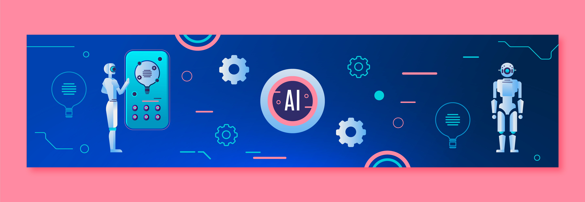

<h1>
IA NA EDUCAÇÃO 🤖
</h1>

Esse estudo visa investigar as percepções de estudantes do ensino superior em relação à interação entre Inteligência Artificial (IA) e Educação. Em um mundo cada vez mais digitalizado, a IA desempenha um papel fundamental na transformação do ambiente educacional, oferecendo oportunidades de personalização do ensino e otimização da aprendizagem. No entanto, essa integração levanta questões éticas e sociais que merecem uma análise aprofundada.
 
Ao compreender as percepções dos estudantes, este estudo busca contribuir para o desenvolvimento de políticas e práticas educacionais que promovam uma integração responsável e equitativa da IA no contexto educacional. 

<h2>
Objetivo
</h2>

Analisar as percepções de estudantes do ensino superior sobre IA na Educação.

<h2>
Sobre a base de dados
</h2>

Para as análises foi utilizada a base <a href="https://www.kaggle.com/datasets/gianinamariapetrascu/survey-on-students-perceptions-of-ai-in-education">Students' Perceptions of AI in Education</a> disponivel na plataforma Kaggle.

<h2>
Conclusão
</h2>

Em andamento

